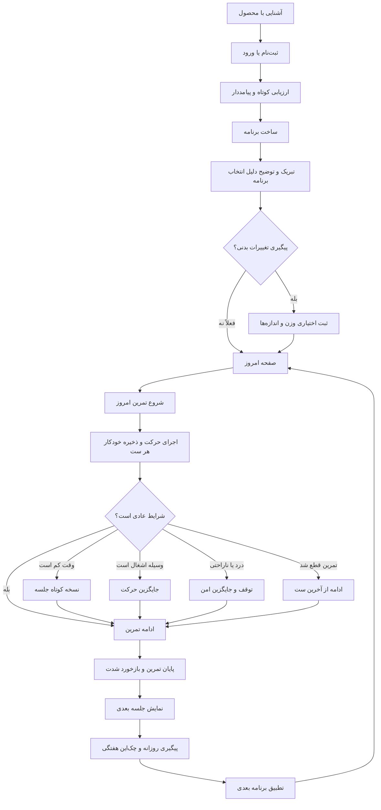

# نقشه جامع سفر مشتری جیم کوچ

> سند مرجع تجربه مشتری؛ از نخستین آشنایی تا ساخت عادت، اجرای تمرین در شرایط واقعی زندگی، پیگیری پیشرفت و دریافت برنامه بعدی

---

## هدف سند

این سند تجربه مطلوب محصول را تعریف می‌کند و مرجع تصمیم‌گیری برای طراحی، توسعه، محتوا، تحلیل داده و پشتیبانی است. هر قابلیت باید یکی از این سه کار را برای مشتری ساده‌تر کند:

۱. **پیش از تمرین:** تصمیم‌گیری و آماده‌شدن
۲. **هنگام تمرین:** اجرای درست، ثبت سریع و مدیریت اتفاق‌های پیش‌بینی‌نشده
۳. **پس از تمرین:** دریافت حس موفقیت، دیدن پیشرفت و دانستن قدم بعدی

اصل مرکزی محصول:

> وقتی وارد باشگاه می‌شوم، می‌خواهم دقیقاً بدانم امروز چه تمرینی دارم، اگر شرایط تغییر کرد فوراً برنامه را تطبیق دهم و بدانم برای پیشرفت بعدی چه کاری انجام دهم.

---

## اصول غیرقابل‌مذاکره تجربه

### هر سؤال باید پیامد داشته باشد

هیچ سؤالی پیش از دریافت ارزش از مشتری پرسیده نمی‌شود، مگر اینکه پاسخ آن مستقیماً برنامه اولیه را تغییر دهد.

| اطلاعات | تصمیمی که باید تغییر کند | زمان دریافت |
|---|---|---|
| هدف | بازه تکرار، حجم و روش پیشرفت | پیش از ساخت برنامه |
| سابقه تمرین | حجم اولیه، پیچیدگی و شدت | پیش از ساخت برنامه |
| تعداد جلسات در هفته | تقسیم تمرینی | پیش از ساخت برنامه |
| زمان هر جلسه | تعداد حرکت و حجم جلسه | پیش از ساخت برنامه |
| تجهیزات در دسترس | انتخاب حرکت‌ها | پیش از ساخت برنامه |
| درد و محدودیت | حذف یا جایگزینی حرکت‌ها | پیش از ساخت برنامه |
| عضلات اولویت‌دار | توزیع حجم | پیش از ساخت برنامه |
| سبک تمرین مورد علاقه | گرایش انتخاب حرکت‌ها | پیش از ساخت برنامه |
| روزهای دقیق هفته | زمان‌بندی تقویم | پس از ساخت برنامه |
| ساعت ترجیحی | یادآوری | پس از ساخت برنامه |
| وزن و اندازه‌های بدن | خط پایه پیگیری پیشرفت | پس از ساخت برنامه و کاملاً اختیاری |
| عملکرد جلسه‌های قبلی | وزنه، تکرار یا حجم جلسه بعدی | در چرخه استفاده |

### ابتدا امروز، سپس برنامه کامل

صفحه اصلی عضو باید به سؤال «امروز چه کار کنم؟» پاسخ دهد. نمایش کل دوره یک مسیر فرعی است، نه نخستین مواجهه روزانه.

### زبان ساده برای مبتدی، اطلاعات کافی برای حرفه‌ای

شدت به زبان قابل‌فهم نمایش داده می‌شود:

> شدت پیشنهادی: متوسط رو به سخت<br>
> وزنه‌ای انتخاب کن که در پایان ست احساس کنی حدود ۲ تکرار دیگر هم می‌توانستی انجام بدهی.

اصطلاح تخصصی یا برچسب انگلیسی نباید در رابط مشتری نمایش داده شود.

### فارسی یکپارچه

- نام بخش‌ها، حرکت‌ها، جلسه‌ها، دکمه‌ها، واحدها و پیام‌ها فارسی هستند.
- همه اعداد نمایشی با رقم فارسی نوشته می‌شوند.
- نام جلسه باید معنا داشته باشد؛ مانند «سینه، پشت و سرشانه» یا «پا و میان‌تنه»، نه نام‌های کوتاه و مبهم.

### زندگی واقعی بخشی از مسیر اصلی است

کمبود وقت، شلوغی باشگاه، درد روزانه، از دست رفتن جلسه و بسته بودن باشگاه خطا نیستند. محصول باید در همان لحظه یک مسیر جایگزین امن و سریع ارائه کند.

### هر اقدام فوراً ذخیره می‌شود

تکمیل هر ست باید همان لحظه ذخیره شود. بستن مرورگر، قفل شدن گوشی یا قطع اینترنت نباید زحمت مشتری را از بین ببرد.

---

## مشتری اصلی

### عضو باشگاه یا ورزشکار خانگی

- فارسی‌زبان و عمدتاً کاربر موبایل
- از مبتدی مطلق تا ورزشکار باتجربه
- دارای دسترسی به باشگاه کامل، باشگاه محدود یا تجهیزات خانگی
- علاقه‌مند به تمرین ترکیبی، دستگاه، وزنه آزاد یا کلسیتنیکس
- دارای هدف‌هایی مانند کاهش چربی، عضله‌سازی، افزایش قدرت، فرم‌دهی، آمادگی عمومی یا حفظ وضعیت
- ممکن است در بعضی روزها زمان، انرژی یا تجهیزات متفاوتی داشته باشد
- ممکن است درباره فرم حرکت، درد، انتخاب وزنه یا جایگزینی حرکت مطمئن نباشد

### نگرانی‌های اصلی

۱. برنامه واقعاً متناسب با شرایط او نباشد.
۲. نداند امروز از کجا شروع کند.
۳. حرکت را اشتباه اجرا کند یا دردش بیشتر شود.
۴. دستگاه یا وسیله موردنیاز در دسترس نباشد.
۵. ثبت تمرین زمان‌بر باشد یا با بستن صفحه از بین برود.
۶. با از دست دادن یک جلسه، کل برنامه به‌هم بریزد.
۷. داده‌ای از او گرفته شود بدون اینکه بداند چرا.
۸. بعد از تمرین حس موفقیت یا مسیر بعدی نداشته باشد.

---

## نمای کامل سفر



### مراحل و خروجی موفق

| مرحله | سؤال ذهنی مشتری | پاسخ محصول | خروجی موفق |
|---|---|---|---|
| آشنایی | «این محصول چه مشکلی را حل می‌کند؟» | برنامه شخصی، راهنمای حرکت و تطبیق با روزهای واقعی | شروع ثبت‌نام |
| ثبت‌نام | «چقدر طول می‌کشد؟» | ورود کوتاه و روشن | ورود به ارزیابی |
| ارزیابی | «چرا این سؤال را می‌پرسید؟» | توضیح کوتاه اثر هر پاسخ | تکمیل بدون خستگی |
| دریافت ارزش | «برنامه من آماده شد؟» | تبریک، خلاصه و دلیل تصمیم‌ها | دیدن تمرین امروز |
| برنامه‌ریزی | «چه روزی تمرین کنم؟» | انتخاب روز و ساعت پس از ساخت برنامه | تقویم و یادآور |
| اجرای تمرین | «الان دقیقاً چه کنم؟» | حرکت فعلی، ست فعلی، آموزش و ثبت فوری | تکمیل جلسه |
| اتفاق غیرمنتظره | «اگر امروز شرایط فرق داشت چه؟» | نسخه کوتاه، انتقال جلسه یا جایگزین حرکت | ادامه بدون خروج از محصول |
| پایان تمرین | «خوب انجام دادم؟» | خلاصه، پاداش و سؤال شدت | ثبت احساس و دیدن قدم بعدی |
| پیشرفت | «دارم نتیجه می‌گیرم؟» | روندهای ساده و توصیه قابل‌اقدام | ادامه چرخه |

---

## مرحله اول: آشنایی و اعتماد

**نقطه تماس:** صفحه اصلی (`/`)

کاربر باید در چند ثانیه بفهمد:

- برنامه برای شرایط خودش ساخته می‌شود.
- امروز دقیقاً می‌داند چه تمرینی دارد.
- آموزش فارسی حرکت‌ها در دسترس است.
- اگر وقت یا تجهیزات تغییر کند، برنامه راه‌حل دارد.
- کلسیتنیکس و تمرین با وزن بدن نیز پشتیبانی می‌شود.

**اقدام اصلی:** «ساخت برنامه رایگان»<br>
**اقدام فرعی:** «چطور کار می‌کند؟»<br>
**حس مطلوب:** امید همراه با اعتماد<br>
**ریسک ریزش:** وعده مبهم، اصطلاح تخصصی یا تصور برنامه آماده و عمومی<br>
**معیار موفقیت:** کلیک روی اقدام اصلی و شروع ثبت‌نام

---

## مرحله دوم: ثبت‌نام و ورود

**مسیرها:** `/auth/signup` و `/auth/login`

ثبت‌نام فقط اطلاعات ضروری حساب را می‌گیرد. متن باید شفاف بگوید داده‌ها کجا نگهداری می‌شوند و آیا حساب در دستگاه دیگر در دسترس است.

**تجربه مطلوب:**

- اعتبارسنجی نزدیک همان فیلد
- حفظ اطلاعات پس از خطا
- امکان دیدن رمز
- انتقال مستقیم به ادامه مسیر
- بازگشت کاربر قدیمی به آخرین وضعیت ذخیره‌شده

**حس مطلوب:** شروع سریع و بدون نگرانی<br>
**معیار موفقیت:** ثبت‌نام یا ورود موفق و رسیدن به ارزیابی یا صفحه امروز

---

## مرحله سوم: ارزیابی کوتاه و پیامددار

**مسیر:** `/onboarding`

ارزیابی پیش از دریافت ارزش فقط اطلاعات لازم برای ساخت برنامه نخست را می‌گیرد. هر مرحله توضیح می‌دهد پاسخ کاربر چه چیزی را تغییر می‌دهد.

### هدف و اولویت عضلانی

- هدف اصلی
- حداکثر ۳ ناحیه اولویت‌دار
- اثر پاسخ: بازه تکرار، حجم، روش پیشرفت و توزیع تمرکز

### سابقه تمرین

- سطح تجربه
- مدت تمرین منظم
- اثر پاسخ: حجم اولیه، پیچیدگی حرکات و شدت پیشنهادی

### زمان در دسترس

- تعداد جلسه در هفته
- مدت تقریبی هر جلسه
- اثر پاسخ: تقسیم تمرینی، تعداد حرکات و حجم هر جلسه

در این مرحله روز دقیق هفته و ساعت تمرین پرسیده نمی‌شود.

### تجهیزات و سبک مورد علاقه

- باشگاه کامل، تجهیزات محدود یا تمرین در خانه
- دستگاه، وزنه آزاد، ترکیبی یا کلسیتنیکس
- اثر پاسخ: بانک حرکات و اولویت انتخاب حرکت

انتخاب کلسیتنیکس فقط یک برچسب نیست. بانک حرکت باید برای هر حرکت این اطلاعات را داشته باشد:

- نام کامل فارسی
- ویدیوی آموزش
- تصاویر شروع و پایان
- مراحل اجرا
- اشتباه‌های رایج
- عضله اصلی و عضلات کمکی
- الگوی حرکتی
- تجهیزات لازم
- سطح دشواری و روش ساده‌تر یا سخت‌تر کردن حرکت
- محدودیت‌ها و هشدارهای ایمنی
- حرکت‌های جایگزین هم‌ارز

نمونه حرکت‌ها شامل شنا سوئدی، بارفیکس، دیپ، اسکوات با وزن بدن، لانج، پل باسن، حرکت خرسی، پلانک و انواع پیشرفت آن‌هاست.

### درد، آسیب و محدودیت

- ناحیه ناراحتی
- محدودیت تعیین‌شده توسط پزشک یا متخصص
- توضیح اختیاری
- اثر پاسخ: حذف، محدودسازی یا جایگزینی حرکت

محصول تشخیص پزشکی نمی‌دهد. درد شدید، تازه یا رو به افزایش باید با پیام واضح به توقف و مراجعه به متخصص منجر شود.

### مرور نهایی

خلاصه فقط پاسخ‌هایی را نشان می‌دهد که در برنامه اثر دارند و کنار هر مورد اثر آن را توضیح می‌دهد.

**اقدام نهایی:** «ساخت برنامه من»<br>
**حس مطلوب:** دیده‌شدن بدون بازجویی<br>
**معیار موفقیت:** تکمیل ارزیابی و تولید برنامه در کمترین زمان ممکن

---

## مرحله چهارم: دریافت اولین ارزش

پس از ساخت برنامه، کاربر ابتدا با یک لحظه موفقیت روبه‌رو می‌شود:

> برنامه‌ات آماده است 🎉<br>
> بر اساس هدفت، سابقه تمرین، زمان و تجهیزاتت ساخته شد.

سپس خلاصه‌ای کوتاه نمایش داده می‌شود:

- تعداد جلسه در هفته
- مدت تقریبی هر جلسه
- سبک غالب
- مهم‌ترین دلیل انتخاب ساختار برنامه

### درخواست اختیاری برای پیگیری بدن

پس از اینکه مشتری ارزش را دیده است، محصول می‌پرسد:

> دوست داری پیشرفت بدنی‌ات را هم دنبال کنیم؟

در صورت پذیرش، موارد زیر کاملاً اختیاری هستند:

- وزن
- دور کمر
- دور بازو
- دور سینه
- دور ران

کنار فرم توضیح داده می‌شود که این داده‌ها برای مقایسه تغییرات آینده هستند و در ساخت برنامه اولیه نقشی ندارند. گزینه «فعلاً نه» باید کاملاً واضح باشد.

### انتخاب تقویم و یادآوری

اکنون محصول می‌پرسد:

> دوست داری جلسه‌ها را چه روزهایی انجام بدهی؟

پس از انتخاب روزها، ساعت ترجیحی فقط برای یادآور پرسیده می‌شود. تغییر ساعت نباید موتور برنامه را دوباره اجرا کند.

**لحظه فعال‌سازی اولیه:** برنامه ساخته شده و تمرین امروز قابل مشاهده است.

---

## مرحله پنجم: صفحه اصلی عضو، با تمرکز بر امروز

**مسیر اصلی پس از ورود:** صفحه «امروز»

نمای اصلی باید فشرده و قابل‌اقدام باشد:

```text
امروز

تمرین سینه، پشت و سرشانه
۶ حرکت · حدود ۵۲ دقیقه

[ شروع تمرین ]

این هفته
✅ شنبه   ○ دوشنبه   ○ چهارشنبه

[ مشاهده برنامه کامل ]
```

### قواعد نام‌گذاری جلسه‌ها

- نام باید عضلات یا هدف جلسه را توضیح دهد.
- حروف کوتاه‌شده و نام‌های انگلیسی نمایش داده نمی‌شوند.
- اگر دو جلسه مشابه وجود دارد، تفاوت آن‌ها معنایی بیان می‌شود؛ مانند «بالاتنه با تمرکز بر فشار» و «بالاتنه با تمرکز بر کشش».

### منوی موبایل

- دکمه منوی همبرگری نباید روی نام مشتری، تاریخ یا عنوان صفحه قرار بگیرد.
- فضای ثابت و امن برای دکمه در سربرگ در نظر گرفته می‌شود.
- ترتیب عناصر در راست‌به‌چپ آزمایش می‌شود.
- ناحیه لمس دکمه حداقل مناسب استفاده با یک دست است.

### برنامه کامل

صفحه برنامه کامل برای مرور هفته‌ها، جلسه‌ها و منطق پیشرفت در دسترس است، اما مشتری را در ورود روزانه با تمام جزئیات دوره مواجه نمی‌کند.

---

## مرحله ششم: پیش از شروع تمرین

کاربر از صفحه امروز یا جزئیات جلسه وارد تمرین می‌شود.

پیش از شروع، محصول نمایش می‌دهد:

- نام معنادار جلسه
- مدت تقریبی
- تعداد حرکت‌ها
- گرم‌کردن پیشنهادی
- تجهیزات اصلی موردنیاز
- گزینه «امروز وقت کمتری دارم»

اگر جلسه‌ای نیمه‌تمام وجود داشته باشد، شروع جلسه جدید با این پیام جایگزین می‌شود:

> ادامه تمرین قبلی؟<br>
> پرس سینه با دمبل — ست ۲ از ۳

اقدام‌ها:

- «ادامه تمرین»
- «پایان دادن به جلسه قبلی»
- «شروع جلسه امروز» پس از تأیید

---

## مرحله هفتم: اجرای هدایت‌شده تمرین

**مسیر:** `/workout/:sessionId`

در هر لحظه فقط اطلاعات لازم برای حرکت و ست فعلی برجسته می‌شود:

- نام فارسی حرکت
- شماره حرکت و تعداد کل حرکت‌ها
- شماره ست و تعداد کل ست‌ها
- بازه تکرار
- شدت پیشنهادی به زبان ساده
- زمان استراحت
- نکته کوتاه اجرا
- آموزش کامل حرکت
- دکمه «جایگزین حرکت»

### چرخه هر ست

۱. مشاهده هدف ست<br>
۲. اجرای حرکت<br>
۳. ثبت تکرار و وزنه یا نوع پیشرفت حرکت<br>
۴. ذخیره خودکار فوری<br>
۵. شروع استراحت<br>
۶. رفتن به ست بعدی

ذخیره هر ست مستقل است. اگر صفحه بسته شود، وضعیت حرکت، شماره ست، مقادیر ثبت‌شده و زمان شروع جلسه باقی می‌ماند.

### راهنمای حرکت

راهنما بدون خروج از جریان تمرین باز می‌شود و شامل ویدیو، تصویر، مراحل اجرا، اشتباه‌های رایج، عضلات هدف، هشدارها و روش تنظیم حرکت است. بستن آن با دکمه واضح، کلید فرار یا لمس بیرون امکان‌پذیر است.

### انتخاب شدت برای مبتدی

به‌جای عدد یا اصطلاح تخصصی، راهنمای عملی نمایش داده می‌شود؛ برای نمونه:

> شدت پیشنهادی: متوسط رو به سخت<br>
> وزنه یا نسخه‌ای را انتخاب کن که در پایان ست حس کنی حدود ۲ تکرار دیگر هم می‌توانستی انجام بدهی.

برای حرکت‌های کلسیتنیکس، محصول نسخه مناسب را پیشنهاد می‌کند؛ مثلاً تغییر ارتفاع دست در شنا یا استفاده از کش کمکی در بارفیکس.

---

## مرحله هشتم: مدیریت روزهای واقعی و خراب

این مسیرها بخشی از تجربه اصلی تمرین هستند و نباید به صفحه پشتیبانی یا جست‌وجوی بیرونی وابسته باشند.

### امروز فقط ۳۰ دقیقه وقت دارم

اقدام: «نسخه ۳۰ دقیقه‌ای»

محصول با حفظ گرم‌کردن ضروری و حرکت‌های اصلی، حرکت‌های کم‌اولویت یا ست‌های تکمیلی را حذف می‌کند. خلاصه تغییر نمایش داده می‌شود و تکمیل نسخه کوتاه به‌عنوان یک جلسه موفق ثبت می‌شود.

### دستگاه یا وسیله اشغال است

اقدام کنار همان حرکت: «جایگزین حرکت»

پیشنهاد جایگزین باید تا حد ممکن این ویژگی‌ها را حفظ کند:

۱. عضله هدف<br>
۲. الگوی حرکتی<br>
۳. هدف جلسه<br>
۴. تجهیزات واقعاً در دسترس<br>
۵. سطح تجربه<br>
۶. محدودیت و درد کاربر<br>
۷. شدت و حجم قابل‌مقایسه

پیش از تأیید، دلیل پیشنهاد کوتاه بیان می‌شود. کاربر می‌تواند جایگزین را فقط برای امروز یا برای جلسه‌های آینده انتخاب کند. این قابلیت برای نسخه اولیه ضروری است.

### این حرکت را دوست ندارم

کاربر «جایگزین حرکت» را می‌زند و دلیل «دوست ندارم» را انتخاب می‌کند. محصول یک جایگزین هم‌ارز می‌دهد و ترجیح را برای پیشنهادهای آینده یاد می‌گیرد، بدون اینکه یک حرکت ضروری را بی‌دلیل از کل برنامه حذف کند.

### زانو، شانه یا کمرم امروز اذیت می‌شود

محصول شدت درد و تازگی آن را با یک سؤال کوتاه بررسی می‌کند:

- ناراحتی خفیف: پیشنهاد نسخه بدون درد یا جایگزین محافظه‌کارانه
- درد واضح، شدید یا رو به افزایش: توقف حرکت و توصیه مراجعه به متخصص

مشتری نباید برای ادامه‌دادن تحت فشار قرار گیرد. ثبت درد باید انتخاب جلسه‌های بعدی را نیز محافظه‌کارانه کند.

### جلسه برنامه‌ریزی‌شده را از دست دادم

محصول سرزنش نمی‌کند و می‌پرسد:

> جلسه انجام‌نشده را به امروز منتقل کنیم؟

گزینه‌ها:

- انتقال به امروز
- انتقال به نزدیک‌ترین روز خالی
- رد کردن این جلسه و ادامه برنامه

جابجایی نباید دو جلسه سنگین مشابه را پشت سر هم قرار دهد.

### باشگاه بسته است یا به آن دسترسی ندارم

محصول یک نسخه خانگی یا کلسیتنیکس با تجهیزات موجود می‌سازد. الگوی حرکتی و عضلات هدف حفظ می‌شوند و جلسه با برچسب «نسخه خانگی» ثبت می‌شود.

### تمرین ناگهان قطع شد

پس از بازگشت، محصول آخرین وضعیت ذخیره‌شده را نشان می‌دهد و اجازه ادامه از همان ست را می‌دهد. زمان قطع‌شده از مدت فعال تمرین جدا می‌شود تا گزارش گمراه‌کننده نباشد.

### اینترنت قطع شد

ثبت ست‌ها محلی ادامه پیدا می‌کند. وضعیت «ذخیره روی دستگاه» نمایش داده می‌شود و پس از اتصال، همگام‌سازی انجام می‌گیرد.

---

## مرحله نهم: پایان تمرین

پایان تمرین یک لحظه پاداش و یادگیری است، نه فقط یک پیام تأیید.

```text
عالی بود 👏

تمرین امروز کامل شد

۵۲ دقیقه
۶ حرکت
۱۸ ست

جلسه بعدی: چهارشنبه — پا و میان‌تنه

شدت امروز چطور بود؟
[ آسان ] [ مناسب ] [ خیلی سخت ]
```

ثبت شدت باید با یک لمس انجام شود. پاسخ مستقیماً بر پیشنهاد جلسه بعدی اثر می‌گذارد:

- آسان: بررسی افزایش تکرار، سختی حرکت یا وزنه
- مناسب: ادامه مسیر پیش‌بینی‌شده
- خیلی سخت: حفظ یا کاهش فشار و بررسی خواب، درد و خستگی

اگر جلسه کوتاه یا جایگزین‌شده بوده، خلاصه باید همان نسخه واقعی انجام‌شده را گزارش کند.

**حس مطلوب:** افتخار، آرامش و وضوح قدم بعدی<br>
**معیار موفقیت:** ثبت جلسه، پاسخ به شدت و مشاهده جلسه بعدی

---

## مرحله دهم: تغذیه روزانه

**مسیرها:** `/nutrition` و `/nutrition/plan`

تغذیه باید مکمل تمرین باشد و صفحه امروز را شلوغ نکند. تجربه اصلی شامل این موارد است:

- مشاهده هدف انرژی و مواد مغذی با واحد فارسی
- ثبت سریع غذا و مقدار
- جمع روزانه و فاصله تا هدف
- ویرایش یا حذف ثبت اشتباه
- مشاهده پیشنهاد وعده
- پیام‌های غیرقضاوتی در روزهای کم‌پایبندی

اگر اطلاعات تغذیه‌ای برای تصمیم برنامه لازم نیست، گرفتن آن نباید مانع شروع تمرین شود.

---

## مرحله یازدهم: پیشرفت و چک‌این

### مشاهده پیشرفت

**مسیر:** `/progress`

صفحه پیشرفت فقط روندهایی را نشان می‌دهد که به تصمیم بعدی کمک می‌کنند:

- تعداد جلسه‌های کامل‌شده
- ثبات هفتگی
- روند وزنی در صورت ثبت اختیاری
- روند دور کمر در صورت ثبت اختیاری
- پایبندی تغذیه‌ای
- پیشرفت عملکردی حرکت‌ها

نبود اندازه‌های بدن نباید صفحه را ناقص جلوه دهد؛ پیشرفت عملکرد و ثبات تمرین به‌تنهایی ارزشمند هستند.

### چک‌این هفتگی

**مسیر:** `/check-in`

سؤال‌ها شامل خواب، انرژی، گرسنگی، عملکرد، سختی برنامه، درد و میزان پایبندی هستند. محصول بعد از ثبت باید دقیقاً بگوید کدام پاسخ چه تغییری ایجاد کرده است.

نمونه:

> چون این هفته انرژی پایین و تمرین خیلی سخت گزارش شد، افزایش فشار هفته بعد متوقف می‌شود و حجم کمی کاهش می‌یابد.

امتیاز آمادگی ابزار تصمیم‌گیری محصول است و نباید به‌عنوان تشخیص پزشکی نمایش داده شود.

---

## مرحله دوازدهم: پایان دوره و ادامه

در پایان دوره، محصول خلاصه‌ای معنادار ارائه می‌کند:

- جلسه‌های برنامه‌ریزی‌شده و انجام‌شده
- میزان پایبندی
- حرکت‌هایی که در آن‌ها پیشرفت رخ داده
- روندهای بدنی، فقط در صورت ثبت اختیاری
- دردها، جایگزینی‌ها و ترجیح‌های آموخته‌شده
- پیشنهاد برای دوره بعد

کاربر می‌تواند هدف، تعداد روز، زمان، تجهیزات یا اولویت عضلات را بازبینی کند. فقط تغییر اطلاعات مؤثر باید باعث بازسازی برنامه شود.

---

## حلقه‌های بازگشت

### حلقه روز تمرین

**یادآوری → صفحه امروز → شروع یا تطبیق جلسه → ثبت ست‌ها → پایان و پاداش → نمایش جلسه بعدی**

### حلقه جلسه

**حرکت → ست → ذخیره خودکار → استراحت → ست بعدی → حرکت بعدی → بازخورد شدت**

### حلقه هفتگی

**انجام جلسه‌ها → مرور ثبات و عملکرد → چک‌این → توضیح تغییر → هفته بعد**

### حلقه دوره‌ای

**پایان دوره → خلاصه پیشرفت → بازبینی هدف و شرایط → برنامه تازه**

---

## جدول جامع حالت‌ها و پاسخ محصول

| وضعیت مشتری | پاسخ فوری محصول | نتیجه مطلوب |
|---|---|---|
| مهمان وارد صفحه محافظت‌شده می‌شود | انتقال به ورود با توضیح کوتاه | بازگشت به مقصد پس از ورود |
| ارزیابی نیمه‌تمام است | ادامه از آخرین مرحله ذخیره‌شده | جلوگیری از تکرار پاسخ‌ها |
| پاسخ نامعتبر است | خطای نزدیک فیلد و حفظ داده | اصلاح سریع |
| ساخت برنامه شکست می‌خورد | حفظ پاسخ‌ها و امکان تلاش دوباره | از دست نرفتن زحمت کاربر |
| برنامه آماده شد | تبریک و نمایش تمرین امروز | دریافت سریع ارزش |
| پیگیری بدن را نمی‌خواهد | عبور بدون فشار | حفظ اعتماد |
| روز تمرین فرارسیده | یادآور و اقدام مستقیم | شروع جلسه |
| امروز روز استراحت است | نمایش جلسه بعدی و فعالیت سبک اختیاری | وضوح بدون فشار |
| فقط ۳۰ دقیقه وقت دارد | نسخه کوتاه | حفظ عادت |
| دستگاه اشغال است | جایگزین هم‌ارز | ادامه بدون جست‌وجوی بیرونی |
| حرکت را دوست ندارد | ثبت ترجیح و جایگزین | شخصی‌سازی آینده |
| درد دارد | توقف، بررسی کوتاه و گزینه امن | ایمنی |
| باشگاه بسته است | نسخه خانگی یا کلسیتنیکس | حفظ جلسه |
| جلسه را از دست داده | انتقال، جابجایی یا رد کنترل‌شده | جلوگیری از به‌هم‌ریختن برنامه |
| مرورگر بسته می‌شود | ذخیره خودکار هر ست | ادامه دقیق |
| اینترنت قطع می‌شود | ثبت محلی و همگام‌سازی بعدی | بدون وقفه |
| جلسه قبلاً کامل شده | نمایش خلاصه و جلسه بعدی | جلوگیری از ثبت تکراری |
| شناسه جلسه نامعتبر است | پیام واضح و بازگشت به امروز | خروج از بن‌بست |
| اعلان رد شده | یادآور داخل برنامه و راهنمای فعال‌سازی | حفظ مسیر جایگزین |
| حساب روی دستگاه دیگر باز می‌شود | همگام‌سازی وضعیت | تداوم تجربه |

---

## نقاط اوج تجربه

۱. فهمیدن وعده محصول در چند ثانیه<br>
۲. دیدن اثر هر پاسخ در ارزیابی<br>
۳. پیام «برنامه‌ات آماده است»<br>
۴. دیدن تمرین امروز به‌جای جدول سنگین دوره<br>
۵. نخستین ویدیوی آموزشی واضح و فارسی<br>
۶. جایگزین‌کردن حرکت بدون خروج از برنامه<br>
۷. بازگشت دقیق به ست نیمه‌تمام<br>
۸. خلاصه پاداش‌دهنده پایان تمرین<br>
۹. دیدن نخستین پیشرفت عملکردی یا بدنی<br>
۱۰. فهمیدن اینکه بازخورد هفتگی واقعاً برنامه را تغییر داده است

---

## لحن و محتوای تجربه

- کوتاه، مستقیم، همراه و بدون قضاوت
- استفاده از فعل‌های روشن مانند «شروع کن»، «ادامه بده» و «جایگزین کن»
- پرهیز از اصطلاح تخصصی بدون توضیح
- پرهیز از القای شکست برای جلسه ازدست‌رفته یا نسخه کوتاه
- توضیح دلیل درخواست داده پیش از دریافت آن
- هشدار ایمنی مشخص، آرام و غیرترساننده
- اعداد، واحدها و نام حرکت‌ها به فارسی

نمونه لحن مناسب:

> امروز وقت کم داری؟ نسخه ۳۰ دقیقه‌ای را انجام بده؛ حرکت‌های اصلی حفظ می‌شوند.

نمونه لحن نامناسب:

> برنامه امروز را کامل نکردی و از هدفت عقب افتادی.

---

## رویدادهای تحلیلی پیشنهادی

نام فنی رویدادها برای پیاده‌سازی ثابت می‌ماند، اما هیچ‌کدام نباید به مشتری نمایش داده شوند.

| لحظه | رویداد | ویژگی‌های مهم |
|---|---|---|
| مشاهده صفحه اصلی | `landing_viewed` | منبع، دستگاه، اندازه صفحه |
| شروع ثبت‌نام | `signup_started` | اقدام انتخاب‌شده |
| پایان ثبت‌نام | `signup_completed` | کاربر جدید یا بازگشتی |
| شروع ارزیابی | `onboarding_started` | — |
| پایان مرحله ارزیابی | `onboarding_step_completed` | مرحله، زمان، بازگشت |
| تکمیل ارزیابی | `onboarding_completed` | هدف، سطح، تعداد جلسه، سبک |
| ساخت برنامه | `program_generated` | تقسیم تمرینی، مدت، تجهیزات |
| مشاهده تبریک | `program_reveal_viewed` | زمان تا دریافت ارزش |
| پذیرش پیگیری بدن | `body_tracking_accepted` | فیلدهای انتخابی |
| رد پیگیری بدن | `body_tracking_skipped` | — |
| تنظیم روزها | `schedule_configured` | تعداد روز |
| ساخت یادآور | `reminder_created` | روز و زمان |
| مشاهده امروز | `today_viewed` | وضعیت روز |
| شروع تمرین | `workout_started` | جلسه، نسخه اصلی یا کوتاه |
| تکمیل ست | `workout_set_completed` | حرکت، ست، تکرار، وزنه |
| ذخیره خودکار | `workout_autosaved` | نقطه ذخیره |
| ادامه جلسه قطع‌شده | `workout_resumed` | مدت وقفه، حرکت، ست |
| درخواست نسخه کوتاه | `short_workout_requested` | زمان در دسترس |
| درخواست جایگزین | `exercise_swap_requested` | دلیل، حرکت اصلی |
| پذیرش جایگزین | `exercise_swap_accepted` | حرکت جایگزین، دائمی یا موقت |
| ثبت درد | `pain_reported` | ناحیه و شدت |
| انتقال جلسه | `workout_rescheduled` | روز قبلی و جدید |
| انتخاب نسخه خانگی | `home_workout_selected` | تجهیزات موجود |
| بازکردن آموزش | `exercise_guide_opened` | حرکت و نقطه ورود |
| تکمیل تمرین | `workout_completed` | مدت واقعی، حرکت، ست، نوع نسخه |
| ثبت شدت جلسه | `workout_difficulty_rated` | آسان، مناسب یا خیلی سخت |
| ثبت غذا | `meal_logged` | وعده و مقدار |
| تکمیل چک‌این | `weekly_checkin_completed` | خواب، انرژی، درد، پایبندی |
| اعمال تطبیق | `program_adaptation_applied` | دلیل و نوع تغییر |
| بازگشت به محصول | `app_returned` | فاصله از آخرین فعالیت |

### شاخص اصلی

> تعداد اعضایی که در هر هفته دست‌کم ۲ جلسه متناسب با شرایط واقعی خود را کامل و ثبت می‌کنند.

نسخه کوتاه، خانگی یا دارای حرکت جایگزین نیز یک جلسه موفق محسوب می‌شود.

### شاخص‌های پشتیبان

- نرخ تکمیل ارزیابی
- زمان تا مشاهده برنامه
- نرخ شروع نخستین تمرین
- نرخ تکمیل نخستین جلسه
- نرخ بازگشت به تمرین قطع‌شده
- نرخ موفقیت پس از درخواست جایگزین
- درصد جلسه‌های نجات‌یافته با نسخه کوتاه یا خانگی
- نرخ ثبت شدت پایان تمرین
- نرخ چک‌این هفتگی
- حفظ مشتری در روزهای ۷، ۱۴ و ۲۸
- نرخ پذیرش اختیاری پیگیری بدن
- تعداد خروج‌ها از تمرین برای جست‌وجوی حرکت در منبع دیگر

---

## اولویت تجربه محصول

### ضروری برای نسخه اولیه تمرین

- صفحه امروز با اقدام روشن
- نام فارسی و معنادار جلسه‌ها
- بانک حرکت کامل با آموزش تصویری
- پشتیبانی واقعی از کلسیتنیکس
- راهنمای شدت با زبان ساده
- ذخیره خودکار هر ست و ادامه جلسه
- جایگزینی حرکت در همان صفحه تمرین
- ثبت پایان جلسه و پرسش شدت
- رعایت محدودیت‌ها و پیام‌های ایمنی
- رابط راست‌به‌چپ بدون هم‌پوشانی منوی موبایل

### ضروری برای نخستین چرخه نگهداشت

- نسخه ۳۰ دقیقه‌ای
- انتقال جلسه ازدست‌رفته
- نسخه خانگی هنگام نبود دسترسی به باشگاه
- برنامه‌ریزی روزها و یادآورها پس از ساخت برنامه
- چک‌این و توضیح تغییر برنامه
- صفحه پیشرفت مبتنی بر ثبات و عملکرد

### توسعه پس از تثبیت مسیر اصلی

- مربی هوشمند گفت‌وگویی
- گسترش پیشرفته تغذیه
- تحلیل عمیق‌تر روندها
- روش‌های مربیان متعدد

قابلیت گفت‌وگویی نباید پیش از پایداری ذخیره تمرین، جایگزینی حرکت و بازیابی جلسه در اولویت قرار گیرد.

---

## نقش ادمین و مربی در پشت صحنه

ادمین و مربی کیفیت تجربه را با این داده‌ها مدیریت می‌کنند:

- بانک حرکت، نام فارسی، ویدیو و تصاویر
- عضلات و الگوهای حرکتی
- تجهیزات و محدودیت‌ها
- پیشرفت‌های ساده‌تر و سخت‌تر کلسیتنیکس
- شبکه جایگزین‌های هم‌ارز
- قوانین حجم، شدت و پیشرفت
- پیام‌های ایمنی
- نسخه‌های کوتاه و خانگی جلسه‌ها

روش مربی می‌تواند ساختار برنامه و گرایش انتخاب حرکت را تغییر دهد، اما نمی‌تواند محدودیت کاربر، ایمنی، زمان، تجهیزات یا ترجیح ثبت‌شده او را نادیده بگیرد. هر تغییر روش باید نسخه‌پذیر، قابل‌بازبینی و قابل‌ردیابی باشد.

---

## تعریف موفقیت نهایی سفر

مشتری فقط با ثبت‌نام یا دیدن برنامه فعال نشده است. سفر زمانی موفق است که:

۱. با کمترین سؤال لازم برنامه متناسب دریافت کند.<br>
۲. در صفحه امروز فوراً قدم بعدی را بفهمد.<br>
۳. نخستین جلسه را بدون نیاز به منبع بیرونی انجام دهد.<br>
۴. در صورت تغییر شرایط، جلسه را تطبیق دهد و رها نکند.<br>
۵. پس از تمرین حس موفقیت و مسیر جلسه بعدی را ببیند.<br>
۶. بازخورد و عملکرد او واقعاً تصمیم جلسه‌ها و هفته‌های بعد را تغییر دهد.

> مقصد محصول ساختن یک برنامه بی‌نقص روی کاغذ نیست؛ ساختن تجربه‌ای است که در زندگی واقعی قابل اجرا، قابل تطبیق و قابل ادامه باشد.

---

<sub>نسخه سند: ۲.۰ · بازنگری‌شده در مرداد ۱۴۰۵</sub>
