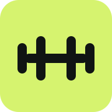
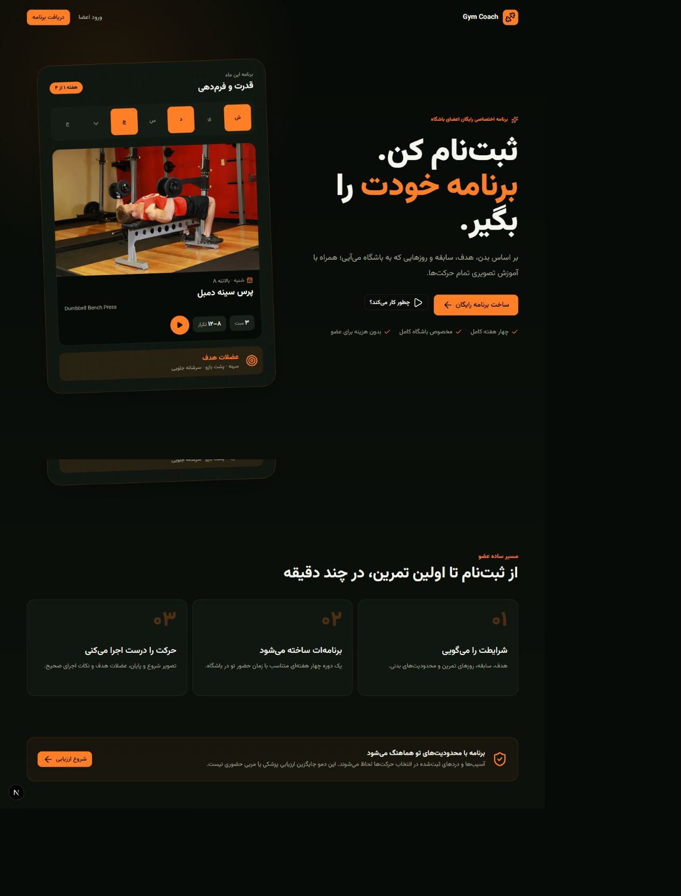
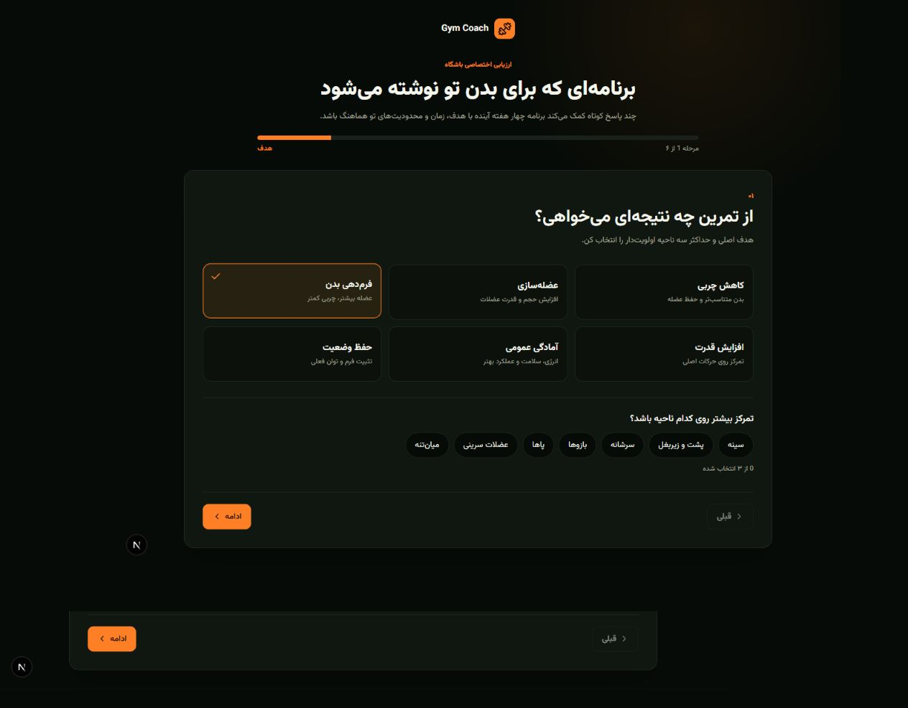
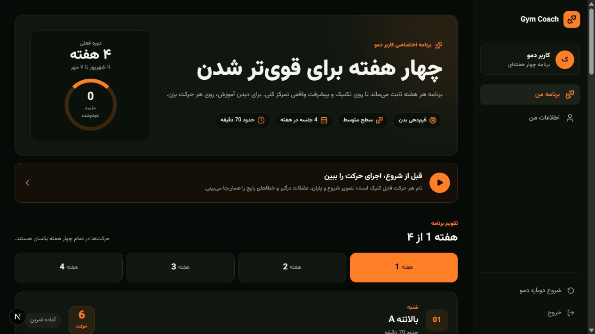
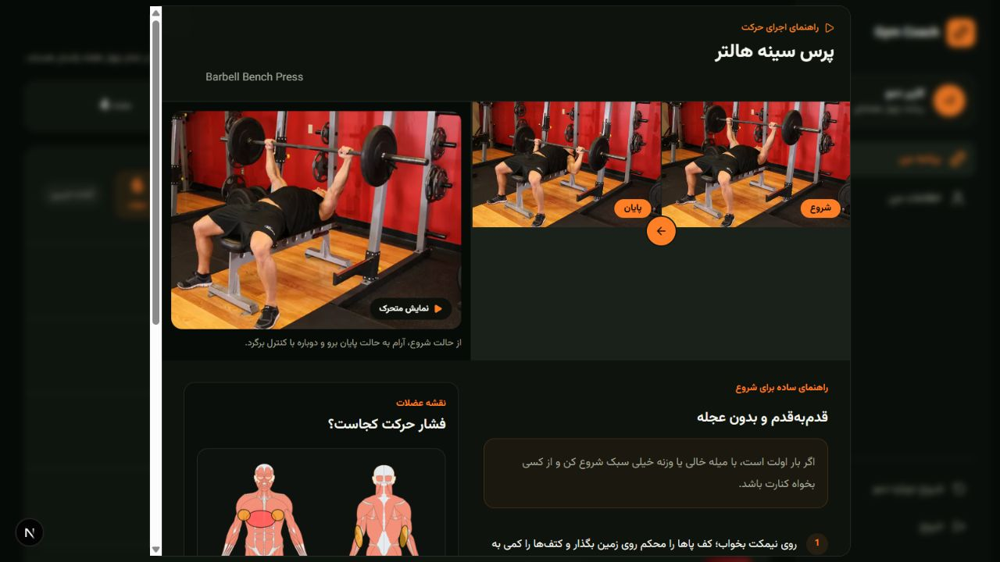
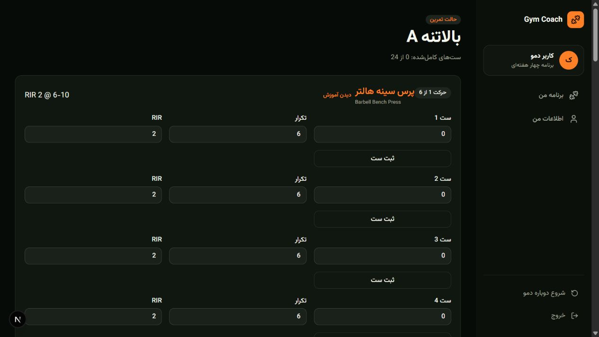

<div align="center" dir="rtl">
  
  <h1>Gym Coach — برنامه تمرینی شخصی‌سازی‌شده</h1>
  <p><strong>یک تجربه‌ی فارسی و راست‌به‌چپ که مسیر عضو را از چند پاسخ کوتاه تا اجرای مطمئنِ هر ست در باشگاه همراهی می‌کند.</strong></p>

  <p>
    <a href="#مسیر-محصول">مسیر محصول</a> ·
    <a href="#راهنمای-تصویری">راهنمای تصویری</a> ·
    <a href="#تصمیمهای-uiux">تصمیم‌های UI/UX</a> ·
    <a href="#معماری">معماری</a> ·
    <a href="#شروع-سریع">شروع سریع</a>
  </p>

  <p>
    
    
    
    
  </p>
</div>

<br />

<div dir="rtl">

## محصول، در یک نگاه

Gym Coach یک MVP **تمرین‌محور** برای اعضای باشگاه است. محصول به‌جای نمایش یک جدول ثابت، با درک هدف، توان، زمان، سبک تمرین و محدودیت‌های کاربر، یک دوره‌ی چهار هفته‌ای قابل اجرا می‌سازد. در لحظه‌ی تمرین، کاربر ست، وزنه، تکرار و شدت را ثبت می‌کند و برای هر حرکت به آموزش تصویری، عضلات درگیر و خطاهای رایج دسترسی دارد.

> هدف محصول ساختن «برنامه‌ی بی‌نقص روی کاغذ» نیست؛ هدف، ساختن تجربه‌ای است که در باشگاه واقعی قابل فهم، قابل اجرا و قابل ادامه باشد.

<table>
  <thead>
    <tr><th align="right">تمرکز نسخه‌ی فعلی</th><th align="right">مرز روشن MVP</th></tr>
  </thead>
  <tbody>
    <tr>
      <td>شخصی‌سازی برنامه، راهنمای حرکت و ثبت تمرین در یک مسیر فارسی و راست‌به‌چپ.</td>
      <td>حساب، داده و برنامه در مرورگر کاربر ذخیره می‌شوند؛ این نسخه هنوز به Auth، دیتابیس یا AI production متصل نیست.</td>
    </tr>
  </tbody>
</table>

## مسیر محصول

<pre dir="ltr">
 ┌───────────┐   ┌─────────────────┐   ┌───────────────────┐
 │  Landing  │ → │ Signup / Login  │ → │  6-step assessment │
 └───────────┘   └─────────────────┘   └─────────┬─────────┘
                                                   │
                                                   ▼
                                      ┌──────────────────────┐
                                      │ 4-week training plan │
                                      └──────────┬───────────┘
                                                 │
                    ┌────────────────────────────┴────────────────────────────┐
                    ▼                                                         ▼
         ┌──────────────────┐                                     ┌──────────────────┐
         │ Exercise guide   │                                     │ Live workout log │
         │ form + muscles   │                                     │ sets + RIR + rest│
         └────────┬─────────┘                                     └────────┬─────────┘
                  └───────────────────────► completed workout ◄───────────┘
</pre>

### ۱. شروع با وعده‌ی روشن

صفحه‌ی نخست به‌جای معرفی طولانی، ارزش محصول را در چند ثانیه نشان می‌دهد: برنامه چهار هفته‌ای، مخصوص باشگاه، همراه با آموزش تصویری. کارت پیش‌نمایش برنامه، نتیجه‌ی نهایی را پیش از درخواست اطلاعات شخصی قابل لمس می‌کند.



### ۲. ارزیابی کوتاه، هر پاسخ با اثر مشخص

ارزیابی در شش گام، فقط اطلاعاتی را می‌گیرد که مستقیم روی برنامه اثر دارند: هدف، داده‌های پایه، سابقه، ظرفیت هفتگی، سبک تمرین و محدودیت‌های ایمنی. نمایش پیشرفت و برچسب هر مرحله، بار ذهنی را کاهش می‌دهد و به کاربر می‌گوید کجای مسیر قرار دارد.



### ۳. برنامه‌ای که قابل اسکن است

برنامه‌ی تولیدشده یک چرخه‌ی چهار هفته‌ای را با تقویم، تعداد جلسات، زمان تخمینی، حرکت‌ها، ست، تکرار، استراحت و RIR نشان می‌دهد. کارت هر روز یک اقدام اصلی دارد: دیدن جزئیات یا شروع تمرین؛ اطلاعات حرفه‌ای نیز بدون شلوغ کردن رابط کنار همان حرکت قرار گرفته‌اند.



### ۴. آموزش حرکت در همان زمینه

کاربر برای فهمیدن حرکت از مسیر تمرین خارج نمی‌شود. پنجره‌ی آموزش، حالت شروع و پایان، نمایش متحرک، نکته‌های اجرای مبتدی، خطاهای رایج، نقشه‌ی عضلات و چرای انتخاب حرکت را یک‌جا نشان می‌دهد. این تصمیم، جست‌وجوی بیرونی و تردید هنگام اولین اجرای حرکت را کم می‌کند.



### ۵. ثبت تمرین با داده‌های لازم، نه بیشتر

در صفحه‌ی تمرین، هر ست دارای سه ورودی ساده است: وزنه، تکرار و RIR. ثبت ست، تایمر استراحت را با زمان مناسب همان حرکت آغاز می‌کند؛ پایین صفحه نیز حجم تمرین و پایان جلسه را جمع‌بندی می‌کند. RIR به کاربر می‌گوید چه میزان توان باقی‌مانده هدف است، بدون اینکه مجبور به تمرین تا ناتوانی شود.



## تصمیم‌های UI/UX

<table>
  <thead>
    <tr><th align="right">تصمیم</th><th align="right">چرا مهم است</th><th align="right">نمود آن در رابط</th></tr>
  </thead>
  <tbody>
    <tr>
      <td><strong>اول امروز، بعد جزئیات</strong></td>
      <td>کاربر باشگاه می‌خواهد فوراً بداند چه کاری انجام دهد، نه اینکه در ساختار برنامه گم شود.</td>
      <td>CTA واضح «شروع تمرین»، جلسه‌ی قابل اسکن و مسیر مستقیم به ثبت ست.</td>
    </tr>
    <tr>
      <td><strong>هر سؤال باید نتیجه داشته باشد</strong></td>
      <td>گرفتن اطلاعات بی‌اثر، اعتماد و نرخ تکمیل را کم می‌کند.</td>
      <td>هدف، تجربه، روزهای تمرین، زمان، سبک و محدودیت‌ها مستقیماً Split، حجم، حرکت‌ها و شدت را تغییر می‌دهند.</td>
    </tr>
    <tr>
      <td><strong>فارسی واقعی، نه ترجمه‌ی سطحی</strong></td>
      <td>خواندن سریع در صفحه‌ی کوچک، به زبان و جهت درست وابسته است.</td>
      <td><code>RTL</code>، Vazirmatn، اعداد فارسی و نام‌های واضح؛ نام انگلیسی حرکت فقط به‌عنوان اطلاعات کمکی نمایش داده می‌شود.</td>
    </tr>
    <tr>
      <td><strong>تکنیک پیش از فشار</strong></td>
      <td>برای عضو تازه‌کار، دانستن فرم امن مهم‌تر از افزایش سریع وزنه است.</td>
      <td>آموزش بصری، خطاهای رایج، نقشه عضلات، هشدار ایمنی و هدف RIR کنار حرکت قرار دارند.</td>
    </tr>
    <tr>
      <td><strong>ثبت با حداقل اصطکاک</strong></td>
      <td>اگر ثبت ست زمان‌بر باشد، داده‌ی واقعی برای پیشرفت از دست می‌رود.</td>
      <td>فیلدهای وزنه/تکرار/RIR، دکمه‌ی تک‌ضربه‌ای ثبت ست و تایمر خودکار استراحت.</td>
    </tr>
    <tr>
      <td><strong>رنگ به‌عنوان نشانه‌ی اقدام</strong></td>
      <td>رابط باید در یک نگاه قابل تصمیم‌گیری باشد.</td>
      <td>پس‌زمینه‌ی تیره‌ی کم‌حواس‌پرتی و نارنجی گرم برای CTA، وضعیت فعال و نقاط پیشرفت.</td>
    </tr>
  </tbody>
</table>

<details>
  <summary><strong>منطق شخصی‌سازی برنامه چگونه کار می‌کند؟</strong></summary>
  <br />
  موتور قطعی برنامه‌سازی ابتدا حرکت‌ها را با توجه به تجهیزات باشگاه، سطح تجربه و پرچم‌های ایمنی فیلتر می‌کند. سپس هدف، عضلات اولویت‌دار و سبک مورد علاقه، ترتیب انتخاب حرکت‌ها را تغییر می‌دهند. تعداد روزهای تمرین، Split را تعیین می‌کند؛ زمان جلسه سقف تعداد حرکت‌هاست؛ سطح و هدف، تعداد ست، بازه تکرار، RIR و استراحت را تنظیم می‌کنند. نتیجه یک برنامه‌ی چهار هفته‌ای است که قابل توضیح و قابل آزمون باقی می‌ماند.
</details>

## معماری

<table>
  <thead>
    <tr><th align="right">لایه</th><th align="right">مسئولیت</th><th align="right">مسیرها</th></tr>
  </thead>
  <tbody>
    <tr><td><strong>App Router</strong></td><td>مسیرهای محصول، layout و PWA manifest</td><td><code>src/app</code></td></tr>
    <tr><td><strong>Features</strong></td><td>Landing، احراز هویت دمو، onboarding، برنامه، پروفایل و تمرین فعال</td><td><code>src/features</code></td></tr>
    <tr><td><strong>Domain</strong></td><td>تولید برنامه، فیلتر ایمنی حرکت، RIR، progression و مدل‌های محصول</td><td><code>src/domain</code></td></tr>
    <tr><td><strong>Data</strong></td><td>حرکت‌ها، رسانه‌های آموزشی و داده‌های دمو</td><td><code>src/data</code> · <code>public/exercises</code></td></tr>
    <tr><td><strong>Store</strong></td><td>حساب دمو، پروفایل، برنامه و لاگ تمرین با ماندگاری مرورگر</td><td><code>src/store/app-store.tsx</code></td></tr>
  </tbody>
</table>

### مرز مسئولیت AI و منطق برنامه

منطق تمرین — انتخاب حرکت، فیلتر محدودیت، حجم، RIR و progression — در توابع TypeScript قطعی است تا قابل آزمون و قابل توضیح بماند. این نسخه‌ی تمرین‌محور به هیچ API یا مدل AI برای تولید تصمیم‌های اصلی وابسته نیست.

## مسیرهای اصلی

<table>
  <tbody>
    <tr><td><code>/</code></td><td>Landing و وعده‌ی محصول</td></tr>
    <tr><td><code>/auth/signup</code> · <code>/auth/login</code></td><td>ورود و ساخت حساب دمو</td></tr>
    <tr><td><code>/onboarding</code></td><td>ارزیابی شش‌مرحله‌ای</td></tr>
    <tr><td><code>/program</code></td><td>برنامه‌ی چهار هفته‌ای و راهنمای حرکت</td></tr>
    <tr><td><code>/program/day/[dayId]</code></td><td>جزئیات جلسه</td></tr>
    <tr><td><code>/workout/[sessionId]</code></td><td>ثبت تمرین، ست و تایمر استراحت</td></tr>
    <tr><td><code>/profile</code></td><td>مرور یا ویرایش ورودی‌های اثرگذار بر برنامه</td></tr>
  </tbody>
</table>

## شروع سریع

```bash
npm install
npm run dev -- -p 3000
```

سپس <a href="http://localhost:3000">http://localhost:3000</a> را باز کنید.

### بررسی کیفیت

```bash
npm run typecheck
npm run test
npm run build
```

## وضعیت MVP و گام‌های بعد

<table>
  <thead>
    <tr><th align="right">هم‌اکنون</th><th align="right">برای مسیر کامل‌تر</th></tr>
  </thead>
  <tbody>
    <tr>
      <td>برنامه‌سازی شخصی، راهنمای تصویری حرکت، ثبت ست، RIR، تایمر استراحت، PWA و persistence محلی.</td>
      <td>همگام‌سازی بین دستگاه‌ها، ذخیره‌ی واقعی هر ست، برنامه‌ی کوتاه و جایگزین حرکت، چک‌این هفتگی و بازخورد پایدار پس از پایان تمرین.</td>
    </tr>
  </tbody>
</table>

<blockquote>
  <strong>یادداشت ایمنی:</strong> این محصول ابزار همراه تمرین است و جایگزین ارزیابی پزشکی، تشخیص یا مربی حضوری نیست. در صورت درد شدید، آسیب تازه یا محدودیت پزشکی، تمرین باید با متخصص مربوطه بررسی شود.
</blockquote>

## منابع رسانه‌ای

تصاویر مرجع شروع و پایان حرکت‌ها از دیتاست عمومی <a href="https://github.com/yuhonas/free-exercise-db">Free Exercise DB</a> می‌آیند و برای اجرای مستقل از API در <code>public/exercises</code> نگه‌داری می‌شوند. اسکرین‌شات‌های این README از نسخه‌ی محلی همین پروژه در مسیر <code>public/screenshots</code> گرفته شده‌اند.

</div>
