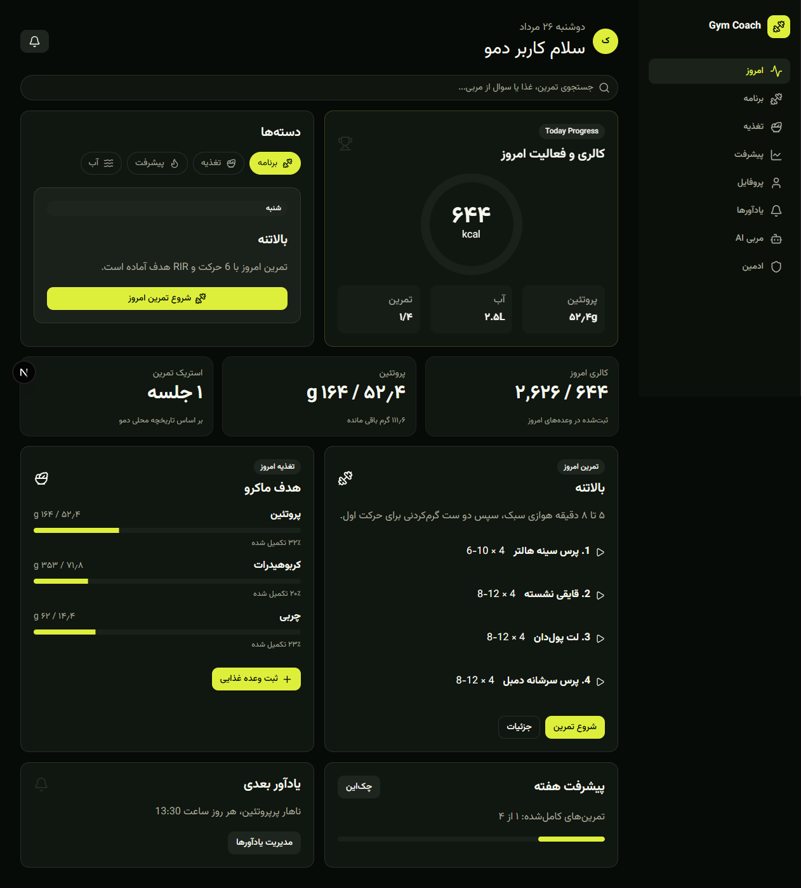

<div align="center" dir="rtl">
  
  <h1>Gym Coach — مربی هوشمند تمرین و تغذیه</h1>
  <p><strong>یک تجربه‌ی فارسی، راست‌به‌چپ و موبایل‌محور برای تبدیل اطلاعات واقعی عضو باشگاه به یک مسیر تمرین و تغذیه‌ی قابل اجرا.</strong></p>

  <p>
    <a href="#شروع-سریع">شروع سریع</a> ·
    <a href="#تجربه-کاربر">تجربه کاربر</a> ·
    <a href="#معماری">معماری</a> ·
    <a href="#وضعیت-mvp">وضعیت MVP</a>
  </p>

  <p>
    
    
    
    
  </p>
</div>

<br />



<br />

<div dir="rtl">

## مسئله‌ای که حل می‌کنیم

برنامه‌های آماده اغلب با زمان، سطح، هدف و محدودیت بدنی فرد هماهنگ نیستند؛ و اعضای تازه‌کار در لحظه‌ی تمرین هم به راهنمای اجرای حرکت و یک مسیر روشن نیاز دارند. Gym Coach این فاصله را با یک جریان ساده پُر می‌کند: ارزیابی کوتاه → برنامه‌ی چهار هفته‌ای → اجرای هدایت‌شده → ثبت داده و اصلاح هفتگی.

> این محصول یک ابزار حمایتی تمرین است و جایگزین تشخیص، درمان یا ارزیابی پزشکی و مربی حضوری نیست.

## تجربه کاربر

<table>
  <thead>
    <tr>
      <th align="right">گام</th>
      <th align="right">آنچه کاربر می‌بیند</th>
      <th align="right">ارزش UX</th>
    </tr>
  </thead>
  <tbody>
    <tr>
      <td><strong>۱. ورود و ارزیابی</strong></td>
      <td>هدف، مشخصات پایه، سابقه، روزهای تمرین، مدت جلسه، سبک تمرین و محدودیت‌ها در ۶ گام کوتاه.</td>
      <td>فقط اطلاعاتی پرسیده می‌شود که روی برنامه اثر می‌گذارد؛ اندازه‌گیری‌های تکمیلی به بعد از ساخت برنامه منتقل شده‌اند.</td>
    </tr>
    <tr>
      <td><strong>۲. برنامه اختصاصی</strong></td>
      <td>تقویم چهار هفته‌ای با Split، تعداد حرکت، ست، تکرار، استراحت و شدت هدف.</td>
      <td>کاربر منطق هر انتخاب را می‌بیند، نه صرفاً یک فهرست مبهم از حرکت‌ها.</td>
    </tr>
    <tr>
      <td><strong>۳. تمرین در باشگاه</strong></td>
      <td>ثبت ست و وزنه، تایمر استراحت، ذخیره خودکار، نسخه‌ی ۳۰ دقیقه‌ای و جایگزین حرکت.</td>
      <td>مسیر تمرین در شرایط واقعی هم تاب‌آور می‌ماند؛ کاربر می‌تواند تمرین را کوتاه یا جابه‌جا کند.</td>
    </tr>
    <tr>
      <td><strong>۴. تغذیه روزانه</strong></td>
      <td>هدف کالری و ماکرو، ثبت سریع غذا و برنامه‌ی غذایی پیشنهادی.</td>
      <td>اعداد به زبان ساده نمایش داده می‌شوند و پیشرفت هر ماکرو در یک نگاه قابل خواندن است.</td>
    </tr>
    <tr>
      <td><strong>۵. بازخورد و پیشرفت</strong></td>
      <td>چک‌این هفتگی، نمودار وزن و دور کمر، پایبندی و توصیه‌ی نسخه‌ی بعدی.</td>
      <td>به‌جای بازطراحی بی‌دلیل برنامه، تغییرات بر پایه‌ی داده‌ی هفته انجام می‌شوند.</td>
    </tr>
  </tbody>
</table>

<br />

<pre dir="ltr">
  SIGN UP
     │
     ▼
  ONBOARDING ──► profile + schedule + safety flags
     │
     ▼
  DETERMINISTIC ENGINE ──► 4-week training program + nutrition target
     │                                  │
     ▼                                  ▼
  TODAY DASHBOARD ◄──────── workout log · food log · reminders
     │
     ▼
  WEEKLY CHECK-IN ──► readiness signal ──► next-week recommendation
</pre>

## طراحی UI/UX

<table>
  <tbody>
    <tr>
      <th align="right">زبان بصری</th>
      <td>سطوح تیره‌ی آرام با سبز لیمویی برای CTAها، وضعیت فعال و نقطه‌های مهم؛ کنتراست بالا کمک می‌کند صفحه در فضای باشگاه سریع خوانده شود.</td>
    </tr>
    <tr>
      <th align="right">تایپوگرافی و جهت</th>
      <td><code>Vazirmatn</code>، رابط کاملاً فارسی و <code>RTL</code>؛ متن‌های انگلیسی نام حرکت با <code>lang="en"</code> جدا شده‌اند تا خوانایی حفظ شود.</td>
    </tr>
    <tr>
      <th align="right">سلسله‌مراتب</th>
      <td>هر صفحه یک تصمیم اصلی دارد: «شروع تمرین»، «ثبت وعده»، «ثبت چک‌این». جزئیات در کارت‌ها و پنل‌های قابل اسکن قرار گرفته‌اند.</td>
    </tr>
    <tr>
      <th align="right">آموزش حرکت</th>
      <td>هر حرکت شامل پیش‌نمایش ویدیویی/متحرک، فریم شروع و پایان، قدم‌های ساده، خطاهای رایج، نقشه عضلات و دلیل حضور آن حرکت در برنامه است.</td>
    </tr>
    <tr>
      <th align="right">طراحی برای واقعیت</th>
      <td>ذخیره خودکار تمرین، ادامه‌ی جلسه‌ی نیمه‌تمام، زمان‌سنج استراحت، انتخاب جایگزین و حالت کوتاه ۳۰ دقیقه‌ای، اصطکاک روز تمرین را کم می‌کنند.</td>
    </tr>
    <tr>
      <th align="right">موبایل و PWA</th>
      <td>رابط واکنش‌گرا، Manifest و Service Worker دارد تا تجربه‌ی نصب‌پذیر و نزدیک به اپ در دسترس باشد.</td>
    </tr>
  </tbody>
</table>

## قابلیت‌ها

<table>
  <tbody>
    <tr><th align="right">تمرین</th><td>تولید برنامه بر اساس هدف، سطح، زمان، تجهیزات و محدودیت‌ها؛ پیشروی، شدت/RIR، تطبیق تمرین و برنامه‌ریزی جلسات.</td></tr>
    <tr><th align="right">تغذیه</th><td>محاسبه‌ی قطعی کالری و ماکرو، لاگ غذا، هدف روزانه و برنامه‌ی غذایی پیشنهادی.</td></tr>
    <tr><th align="right">پیشرفت</th><td>اندازه‌گیری پایه، چک‌این، نمودارها و سیگنال آمادگی برای پیشنهاد هفته‌ی بعد.</td></tr>
    <tr><th align="right">مربی AI</th><td>پاسخ‌های زمینه‌مند با حداقل داده‌ی لازم و مسیر بازبینی روش مربی در پنل ادمین.</td></tr>
    <tr><th align="right">یادآوری</th><td>مدیریت یادآورها، ثبت Service Worker و درخواست مجوز اعلان مرورگر.</td></tr>
    <tr><th align="right">مدیریت</th><td>ورود روش برنامه‌نویسی مربی، استخراج قوانین ساخت‌یافته، بازبینی اختیاری، تأیید و فعال‌سازی.</td></tr>
  </tbody>
</table>

## معماری

<table>
  <thead>
    <tr><th align="right">لایه</th><th align="right">مسئولیت</th><th align="right">مسیرهای اصلی</th></tr>
  </thead>
  <tbody>
    <tr><td><strong>App Router</strong></td><td>مسیرها، layout، PWA manifest و سطح‌های محصول</td><td><code>src/app</code></td></tr>
    <tr><td><strong>Features</strong></td><td>صفحه‌های دامنه‌محور: داشبورد، تمرین، تغذیه، پیشرفت، مربی و ادمین</td><td><code>src/features</code></td></tr>
    <tr><td><strong>Domain</strong></td><td>منطق قابل آزمون برای تمرین، تغذیه، progression، adaptation، یادآورها و روش مربی</td><td><code>src/domain</code></td></tr>
    <tr><td><strong>Store</strong></td><td>حالت اپ و ماندگاری مرورگر در MVP</td><td><code>src/store/app-store.tsx</code></td></tr>
    <tr><td><strong>Data & Providers</strong></td><td>داده‌های اولیه‌ی حرکت/غذا/دانش و قراردادهای AI و اعلان</td><td><code>src/data</code> · <code>src/lib</code></td></tr>
    <tr><td><strong>Database-ready</strong></td><td>Schema و RLS برای مسیر Supabase آینده</td><td><code>20260815000000_initial_schema.sql</code></td></tr>
  </tbody>
</table>

<details>
  <summary><strong>چرا «قطعی» و «AI» از هم جدا هستند؟</strong></summary>
  <br />
  محاسباتی مثل هدف کالری، انتخاب حجم تمرین، progression و محدودیت‌های ایمنی در منطق TypeScript قطعی باقی می‌مانند. AI فقط برای مکالمه و بازبینی روش مربی، با زمینه‌ی محدود، پشت یک قرارداد provider استفاده می‌شود. این جداسازی باعث می‌شود تصمیم‌های اصلی قابل آزمون، قابل توضیح و ایمن‌تر باشند.
</details>

## فناوری‌ها

<p>
  
  
  
  
  
</p>

- Next.js 16 + React 19 + TypeScript
- Tailwind CSS v4, Radix UI, shadcn/ui و Lucide
- Recharts برای روندهای پیشرفت
- Vitest برای تست منطق دامنه
- `localStorage` برای اجرای کامل MVP بدون نیاز به credential
- Supabase schema و RLS برای اتصال آینده

## شروع سریع

<ol>
  <li>Node.js 20.9 یا جدیدتر را نصب کنید.</li>
  <li>وابستگی‌ها را نصب کنید:</li>
</ol>

```bash
npm install
```

<ol start="3">
  <li>فایل محیطی را بسازید:</li>
</ol>

```bash
Copy-Item .env.example .env.local
```

<ol start="4">
  <li>سرور توسعه را اجرا کنید:</li>
</ol>

```bash
npm run dev -- -p 3000
```

سپس <a href="http://localhost:3000">http://localhost:3000</a> را باز کنید.

### بررسی کیفیت

```bash
npm run typecheck
npm run test
npm run build
```

## مسیرهای مهم

<table>
  <tbody>
    <tr><td><code>/</code></td><td>Landing و معرفی محصول</td></tr>
    <tr><td><code>/onboarding</code></td><td>ارزیابی ۶ مرحله‌ای و ساخت برنامه</td></tr>
    <tr><td><code>/dashboard</code></td><td>نمای امروز، جلسه بعد، تغذیه و پیشرفت هفتگی</td></tr>
    <tr><td><code>/program</code></td><td>برنامه چهار هفته‌ای و آموزش حرکت‌ها</td></tr>
    <tr><td><code>/workout/day-1</code></td><td>جریان تمرین هدایت‌شده</td></tr>
    <tr><td><code>/nutrition</code></td><td>ثبت غذا و پیگیری ماکروها</td></tr>
    <tr><td><code>/progress</code> · <code>/check-in</code></td><td>روندها و بازخورد هفتگی</td></tr>
    <tr><td><code>/coach</code> · <code>/admin</code></td><td>مربی AI و مدیریت روش مربی</td></tr>
  </tbody>
</table>

## وضعیت MVP

<table>
  <thead>
    <tr><th align="right">امروز در نسخه موجود است</th><th align="right">برای محصول production باید اضافه شود</th></tr>
  </thead>
  <tbody>
    <tr>
      <td>رابط کامل، منطق تمرین/تغذیه‌ی تست‌شده، داده‌های دمو، ماندگاری مرورگر، Mock AI و آماده‌سازی اعلان مرورگر.</td>
      <td>Supabase Auth و دیتابیس واقعی، API امن برای AI، داده‌های گسترده و تأییدشده، Push native، CRUD سروری و تست E2E.</td>
    </tr>
  </tbody>
</table>

<blockquote>
  <strong>شفافیت:</strong> احراز هویت، AI و داده‌ها در runtime فعلی دمو/محلی هستند. فایل migration برای Supabase آماده است، اما در UI متصل نشده؛ بنابراین هیچ API key یا داده‌ی واقعی کاربر لازم نیست تا محصول را محلی اجرا کنید.
</blockquote>

## ساختار پروژه

```text
src/
├── app/          # مسیرهای Next.js App Router
├── components/   # shell، کامپوننت‌های مشترک و UI primitives
├── data/         # داده‌های اولیه‌ی حرکت، غذا و دانش
├── domain/       # منطق خالص و قابل آزمون محصول
├── features/     # سطح‌های اصلی تجربه کاربر
├── lib/          # providerهای AI، اعلان و ابزارها
└── store/        # state و local persistence
```

## منابع رسانه‌ای

تصاویر مرجع شروع/پایان حرکت‌ها از دیتاست عمومی و بدون محدودیت استفاده‌ی <a href="https://github.com/yuhonas/free-exercise-db">Free Exercise DB</a> می‌آیند و برای عملکرد بدون API در <code>public/exercises</code> نگه‌داری می‌شوند.

</div>
